***

**Official repository of the XLNC Nemeziz team from Kazakhstan. It contains all the engineering materials of our self-driven vehicle's model participating in the WRO Future Engineers competition in the season of 2025.**

Members: Umargaliyev Ali, Sailau Assylzhan

***

***

## Contents

* [**Mobility Management**](#mobility-management)
  * [Motor Selection and Implementation](#motor-selection-and-implementation)
  * [Chassis Design and Implementation](#chassis-design-and-implementation)
* [**Power and Sense Management**](#power-and-sense-management)
  * [Sensor Management](#sensor-management)
  * [Power Management](#power-management)
* [**Obstacle Management**](#obstacle-management)
  * [Sensor-Based Obstacle Detection](#Sensor-Based-Obstacle-Detection)
  * [Trajectory Calibration](#trajectory-calibration)
  * [Integration into the Robot's Program](#Integration-into-the-Robot's-Program)
  * [Pseudo Code](#pseudo-code)
* [**Photos**](#photos)
  * [Team Photos](#team-photos)
  * [Vehicle Photos](#vehicle-photos)
* [**Performance Videos**](#performance-videos)

***
## Our vehicle: 
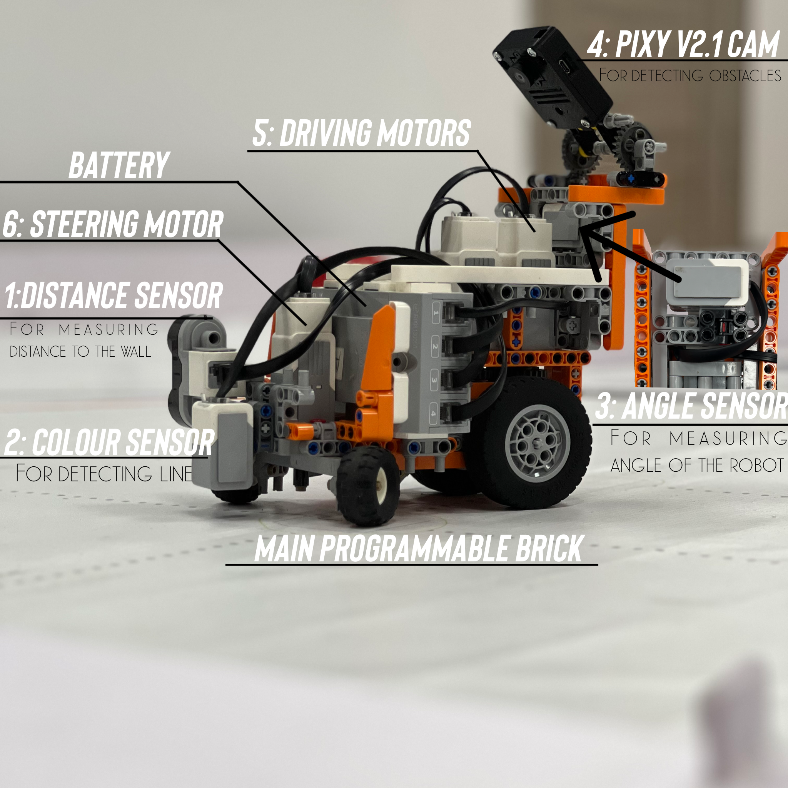
We used components from a EV3 MINDSTORMS Educational kit + a Pixy v2 Camera and some other technic pieces from other sets. 

A full list of all the components (not including the camera) can be found here: [Part List](part-list.pdf)

A 3D model of the robot made in Studio 2.0 can be found here: [3D Model](Models/FE-Robotblack.io)

Our full research on camera placement and detection efficiency is described here: [Research](Pixymon-research/README.md)

The final program/code for our autonomous vehicle can be found here: [Program](Program/Program.ev3)
***

## Mobility Management

### Motor Selection and Implementation

Motor selection is a crucial component of our vehicle's autonomous navigation system. The Lego MINDSTORMS EV3 set provides two distinct motor options: Large Motors and Medium Motors. In making our selection, we considered key factors such as rotation speed, torque, and encoder accuracy.

The Large Motor offers substantial power, however, the Medium Motor, while less powerful, is smaller and lighter. This compact size facilitates quicker responses and conserves space within our vehicle design.
Given the constraints of our compact vehicle dimensions (300x200x300mm) and the emphasis on high-speed navigation, we prioritized the Medium Motor for both the steering and driving mechanisms. Our vehicle employs three Medium motors for its movement system: one for steering and two for driving.

### Chassis Design and Implementation

The steering mechanism, located in the front, utilizes smaller wheels, while the driving mechanism at the rear incorporates larger Lego Technic wheels placed closely together.
The placement of larger wheels at the rear serves multiple practical purposes. Larger wheels cover more ground per revolution, resulting in higher linear speed, which aligns with our priority for speed in the competition. Additionally, positioning the larger rear wheels as close to each other as possible, known as a "narrow rear track," mitigates the absence of a differential system. A narrow rear track minimizes the difference in wheel paths during turns, enhancing the vehicle's maneuverability and reducing wheel scrub.
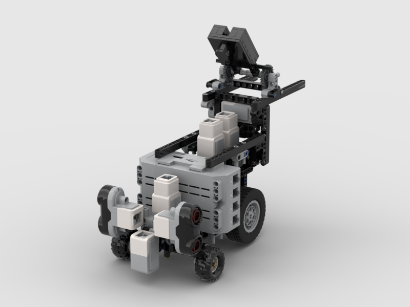
***

## Power and Sense Management

### Sensor Management

Our autonomous vehicle relies on a combination of sensors to execute precise movements, crucial for both obstacle avoidance and the qualification challenges of the competition.

Color Sensor: This sensor is employed to identify turns and determine the driving direction by reading colored lines (orange or blue) on the competition field.

Ultrasonic Sensor: Positioned at the front of the vehicle, the ultrasonic sensor measures the distance between the vehicle and field barriers, ensuring that the vehicle's relative position before and after a turn is continuously known.

Gyro Sensor: The gyro sensor plays a pivotal role in maintaining proper alignment. It detects changes in the vehicle's driving angle, alerting the system to any misalignment or deviation. The implementation of a PID (Proportional-Integral-Derivative) regulator ensures that any deviation from the desired steering angle is continuously corrected, guaranteeing the vehicle's straight and precise trajectory.

The PID regulator operates in a continuous loop throughout the program, ensuring the vehicle remains aligned and on the intended path, supporting its autonomous navigation capabilities.

Pixy v2 Camera: A camera is used to detect and differentiate obstacles during the obstacle round. Custom made 3D Print Models for the [cover](Models/Pixy2_cover.stl) and the [case](Models/Pixy2_case.stl) for the camera can be found in the corresponding links.

### Power Management
The power for the EV3 Brick and the whole vehicle comes from a rechargeable 10V Lithium Battery. Power management within the EV3 brick consists of multiple switching regulations which are tightly controlled and interlinked in order to boot the electronic circuit correctly.
To protect the EV3 brick from short circuit, 3 poly switches are included, one for each of the two motor drivers and one for the rest of the circuit. Each poly switch has a hold current at approximately 1.1 A and will be triggered at approximately 2.2 A.

Power Schemes for every electronic part of the vehicle can be found here:

[EV3 P-Brick](Schemes/Programmable_brick.pdf)

[Rechargeable Battery](Schemes/Rechargeable_battery.pdf)

[Medium Motor](Schemes/Medium_motor.pdf)

[Pixy v2](Schemes/Pixy2.pdf)

[Color Sensor](Schemes/Color_sensor.pdf)

[Gyro Sensor](Schemes/Gyro_sensor.pdf)

[Ultrasonic Sensor](Schemes/Ultrasonic_sensor.pdf)

***

## Obstacle Management

Effective obstacle management is a critical aspect of our autonomous self-driving robot's navigation system, ensuring it can safely and intelligently navigate through challenging scenarios in the WRO competition. In this section, we elaborate on our obstacle management strategies and the key components involved in this crucial aspect of our robot's functionality.

### Sensor-Based Obstacle Detection

Our robot relies on a Pixy v2 Camera to detect obstacles, differentiating between red and green objects with precision. The camera's built-in plugin allows for the recognition of color-based signatures, making it a versatile and efficient tool for identifying obstacles.
To ensure accurate color detection, we employ PixyMon software to calibrate the camera. This calibration process fine-tunes the camera's color recognition capabilities, allowing our robot to precisely distinguish between red and green obstacles on the competition field.

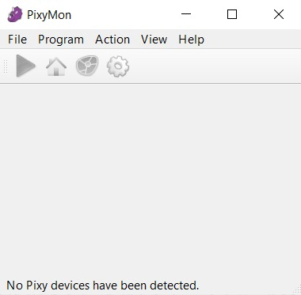

### Trajectory Calibration
Calibrating the robot's trajectory is a vital step in ensuring it safely navigates around obstacles. This process involves placing obstacles in designated locations on the competition field and guiding the robot to drive around them. As the robot maneuvers around obstacles, we record the coordinates of these obstacles in a table for later analysis and fine-tuning.
Once the obstacle coordinates are collected, we import this data into software tools such as Microsoft Excel or Google Sheets. In these programs, we create graphical representations, which often take the form of exponential functions. This function encapsulates the ideal path for the robot to follow when circumventing obstacles.

### Integration into the Robot's Program
With the optimized obstacle-avoidance trajectory in hand, we proceed to integrate it into our robot's program. Our program includes a regulator designed to interpret and act upon the trajectory data.
This regulator operates in real-time, continuously assessing the robot's position in relation to the obstacles and adjusting its path accordingly. By using the trajectory data as a reference, the regulator guides the robot in a manner that ensures smooth and efficient obstacle avoidance. Additionally, a proportional-integral-derivative (PID) controller is employed to further fine-tune and enhance the robot's responsiveness when navigating around obstacles.

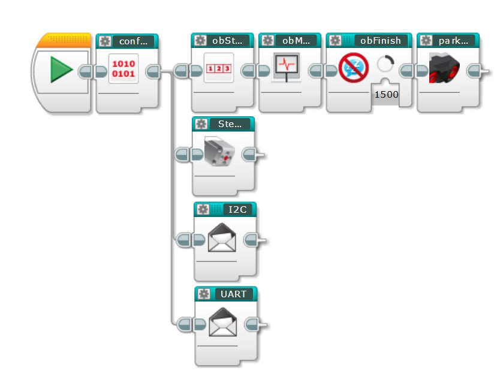

### Pseudo Code

https://github.com/XLNC-Prime/WRO-FE25/blob/48fdc175d8f31680ba57e6de24ae58fa3fdfe8bc/Program/Pseudocode.py#L1-L30 

***

## Photos

### Vehicle Photos
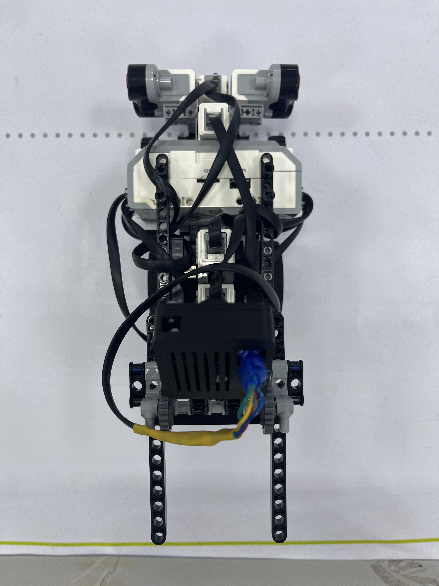
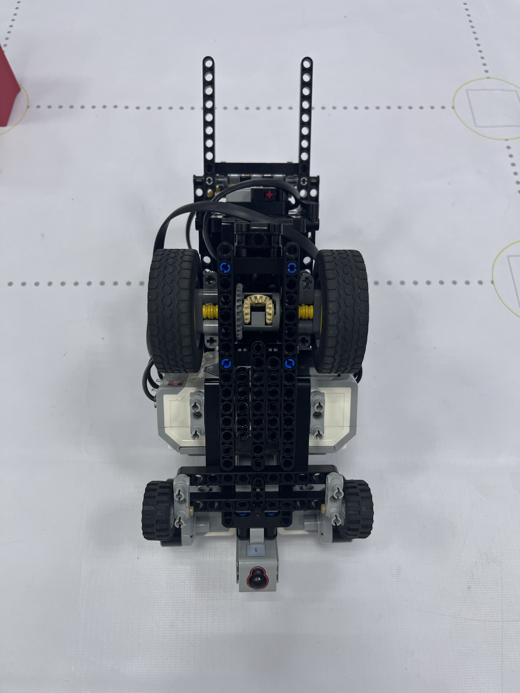
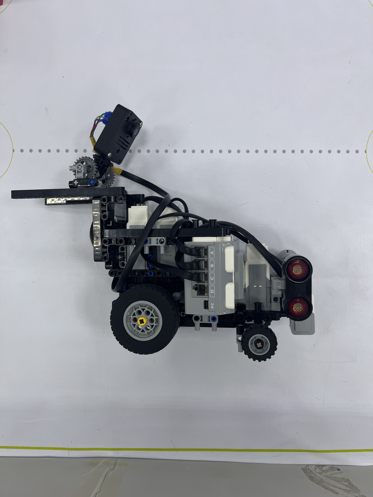
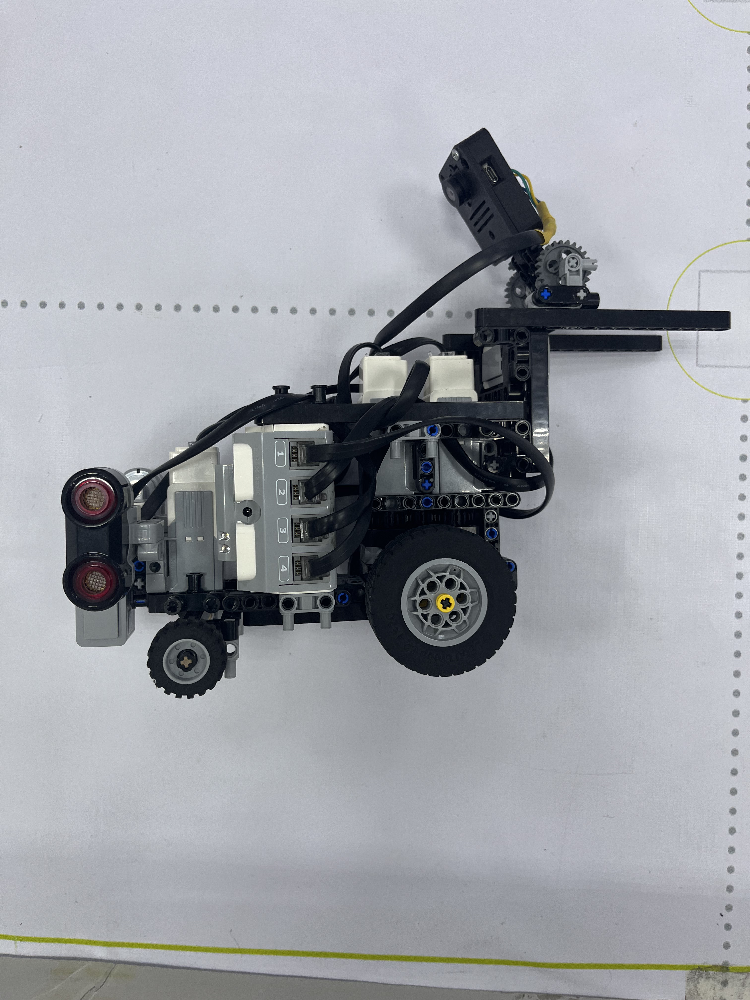
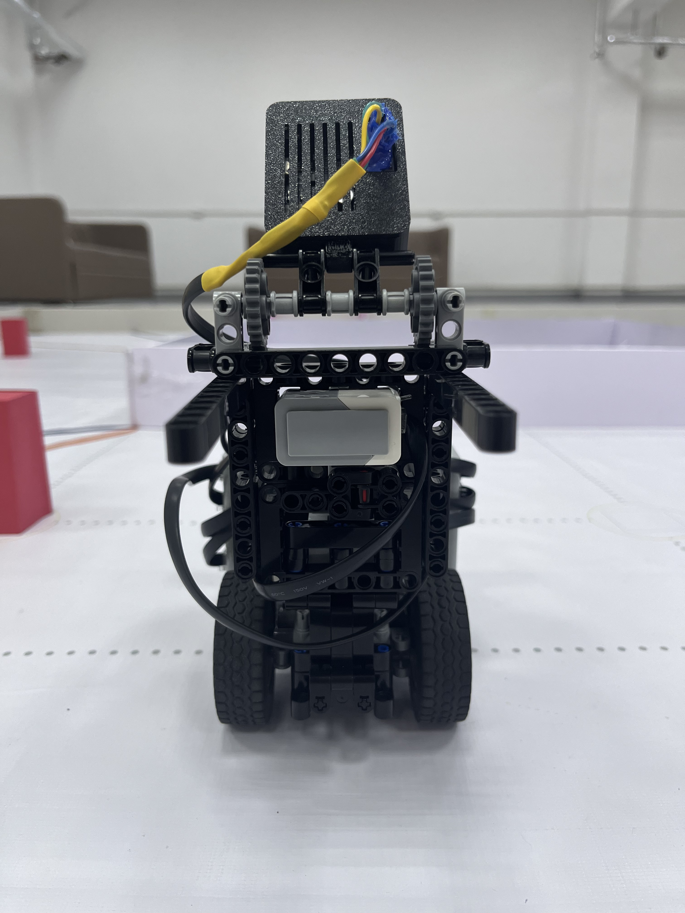
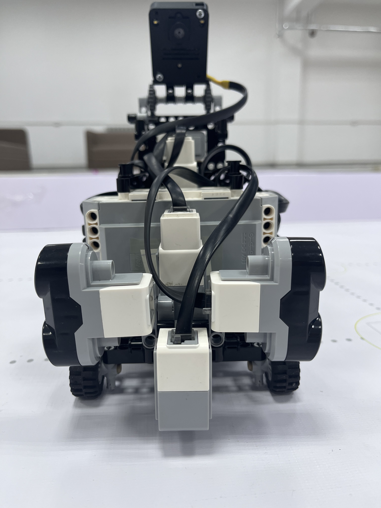

### Team Photos

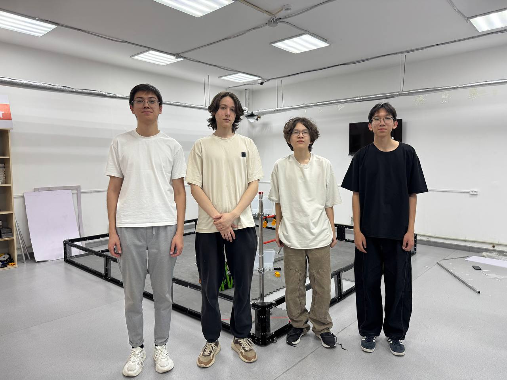
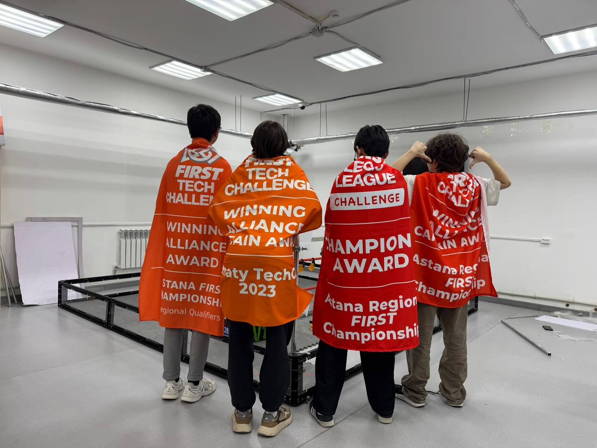

***

## Performance Videos

Open Challenge: [https://youtube.com/shorts/IKujfMRnj0c?si=KcqOzKC9__rHpE8p](https://youtu.be/4B-VcS1g8ug?si=iMcRCpIipyHeDZ9Z)

Obstacle Round Challenge: [https://youtube.com/shorts/YYTXihWzlCA?si=PMUPEU1kPHSlTedE](https://youtu.be/y-L3OCiLIGQ?si=TVY-VJYJtVkHgkoL)
***

